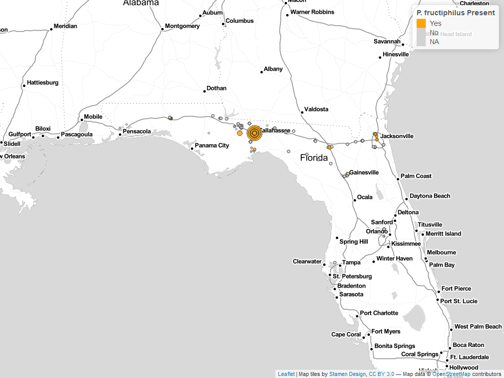

```{r setup, include=FALSE}
knitr::opts_chunk$set(echo = FALSE)
library('tidyverse')
library('kableExtra')
```

# Management of herbivorous mites of rose with predatory mites and Systemic Acquired Resistance
Austin Fife, Gary Knox, Xavier Martini, Mathews Paret

# *Phyllocoptes fructiphilus* Keifer (Trombidiformes: Eriophyidae)
- Feeds on plants in the genus *Rosa*
- Vector for Rose Rosette Virus (RRV)

# RRD Symptoms
```{r rrd-symptoms, cache = TRUE, cache.extra = file.mtime('figure/symp-rrd.tif'), fig.cap="Typical symptoms of Rose Rosette Disease (RRD), caused by Rose Rosette Virus: clusters of deformed flowers known as rosettes/witches' brooms, increased thorniness, elongated shoots, reddened leaves and stems. RRD ultimately kills the rose host.", out.width="80%", warning=FALSE}
grid::grid.raster(tiff::readTIFF("figure/symp-rrd.tif"))
```

# *P. fructiphilius* in Florida
```{r survey-map-1, cache = TRUE, cache.extra = file.mtime('figure/rrv_survey_map_fl_pf.png'), fig.pos = 'p', fig.cap = "\\textit{P. fructiphilus} mites recovered during surveys of roses in Florida, 2017-2021.", out.width="100%", warning=FALSE}

```
- Possibility of introducing RRD from areas where the disease had become established, including the neighboring states of Georgia and Alabama [@Solo2020; @Solo2018]. 

# Integrating Pest Management
- *P. fructiphilus* is hard to control
```{r hiding, cache = TRUE, cache.extra = file.mtime('figure/mite-pfruct-hide.PNG'), fig.cap="Illustration of the typical location of \\textit{Phyllocoptes fructiphilus} on roses. \\textit{P. fructiphilus} are difficult to manage with pesticides due to the protection offered by the sepals.", out.width="80%", warning=FALSE}

```


# Phytoseids an option for control?
- Small species may be able to find and feed on *P. fructiphilus*
- *Amblyseius swirskii* Athias-Henriot (Mesostigmata: Phytoseiidae) mites were attracted towards roses which were infected with RRD
- Too large!
- Model organism

# What caused the attraction to infected roses?
```{r aswir-rrd, fig.cap = "\\textit{Amblyseius swirskii} attraction to healthy and Rose Rosette Virus-infected Pink Double Knock Out® roses. Asterisks represent significant differences as calculated by $\\chi^2$ contingency table tests for given probabilities. N.S. = not significant. RRV-infected vs Healthy Rose: $\\chi^2 = 9.33$, $df = 1$, $\\alpha = 0.05$, $p-value = 0.002$. Filtered Air vs Healthy Rose: $\\chi^2 = 0.47$, df $=$ 1, $\\alpha = 0.05$, $p-value = 0.4913$.", out.width="100%", warning=FALSE}
knitr::include_graphics('figure/rrv_graph_olfact_rose.png')
```
- Low levels of MeSA from RRV-infected roses
- MeSA attractive to some many predatory mites

# MeSA and SAR
- MeSA increases when a plant is attacked by herbivores or pathogens, derivative of Salicylic Acid
- Systemic Acquired Resistance (SAR), protects distant tissues
- Hypersensitive Response
- Enduring resistance
- Pathogen resistance: fungi, bacteria and viral pathogens

# SAR-induction
- Induce SAR *before* RRV infection
- acibenzolar-S-methyl (ASM), benzothiadiazole
- ASM used to protect plants from fungal infection
- Chitinase activity in roses [@Suo2001]
- Hypersensitive response and SAR interferes with the ability of eriophyoid mites to feed or grow on induced plants [@Bronner1991a; @Westphal1991; @Westphal1992].

# How does SAR-induction affect predators?
- Predatory mites may still be harmed via direct and indirect effects of SAR-induction [@Ataide2016, @Pappas2017]

# Design: ASM Trials
- 12 weeks, from August to October
- Griffin and Athens, GA
- low and high pest pressure 
- Plants inoculated with canes from nearby RRD-infected roses
- Inoculated 1st and 5th weeks of the experiment
- 48 Pink Double Knock Out® Roses 1 gallon buckets 

# Treatments: ASM
- acibenzolar-S-methyl, ASM (Actigard50WG) 
- Two rates: 50 \si{\milli\gram}/\si{\liter} (Half rate) and 100 \si{\milli\gram}/\si{\liter} (High rate)
- Goal: observe the effects of inducing Systemic Acquired Resistance (SAR) on *P. fructiphilus* 
- Griffin had two controls: 
- Kontos (Spirotetramat), label rate (negative control)
- Water (positive control)
- Athens had untreated roses and water as negative controls

# Data Collection: ASM
- Subset of samples weekly
- Each rose plant has been sampled three times.
- Rose/rosebud cuttings ~10 cm
- Samples in 50 mL centrifuge tubes
- Washing methods of @Monfreda2007
- Counted eriophyoid mites

# Design: IPM Trials
August to October simultaneously in Griffin, GA and Athens, GA.
The Athens site will be given 96 Pink Double Knock Out® Roses (Star Roses and Plants, West Grove, PA, USA), while Griffin will use 54 roses due to the smaller plot area available. Bare root roses will be planted 2 months before the trials begin to allow new flush to form. Rose planting media and environmental conditions will be the same as previously described.

# Treatments - IPM
- ASM (Actigard 50WG) and SP2700, (Ninja, SePro)
- *A. swirskii* 2 mini sachets with hooks sachets per rose
- ASM + *A. swirskii*
- Kontos - spirotetramat acaricide as a negative control 
- Water - a positive control 
- 12 weeks, mites applied on the 1st, 5th and 9th week
- Two blocks, 10 plots, 12 roses/plot w/buffer, six roses treated


# Plot Design - 2018
```{r, cache = TRUE, cache.extra = file.mtime('figure/rrv_asm_plot_2018_griffin.png'), fig.cap= "Field design for testing the potential of Acibenzolar-S-Methyl to reduce populations of \\textit{P. fructiphilus} by inducing Systemic Acquired Resistance in Pink Double Knock Out® roses. Trials were conducted for three months from September to December 2019 in Griffin, GA. Four treatments were applied weekly fo 12 weeks: Blue = Water Red = Actigard50WG 100 \\si{\\milli\\gram}/L (High rate),  Pink = Actigard50WG \\si{\\milli\\gram}/L (Half rate) Turquoise = Kontos (Label rate). Flower cuttings were be taken weekly to record \\textit{P. fructiphilus} numbers.", out.width="80%", warning=FALSE}
knitr::include_graphics('figure/rrv_asm_plot_2018_griffin.png')
```

# Plot Design - 2019
```{r, cache.extra = file.mtime('figure/rrv_asm_plot_2019_griffin.png'), fig.cap="Field design for testing the potential of Acibenzolar-S-Methyl to reduce populations of \\textit{P. fructiphilus} by inducing Systemic Acquired Resistance in Pink Double Knock Out® roses. Trials were conducted for three months from September to December 2019 in Griffin, GA. Four treatments were applied weekly fo 12 weeks: Blue = Water Red = Actigard50WG 100 \\si{\\milli\\gram}/L (High rate),  Pink = Actigard50WG 100 \\si{\\milli\\gram}/L (Half rate) Turquoise = Kontos (Label rate). Flower cuttings were be taken weekly to record \\textit{P. fructiphilus} numbers.", out.width="80%", warning=FALSE}
knitr::include_graphics('figure/rrv_asm_plot_2019_griffin.png')
```

# Data Collection: IPM
- Cuttings taken weekly from six treated roses
- Three flowers (buds if no flowers present) 
- ~18 flowers/buds per bottle for each plot
- Bottles with 95% EtOH
- Sieves to separate mites from the plant tissues.
- Plant tissues dried ~48 hrs at 50 &deg;C, weighed
- *A. swirskii* applied on the 1st, 5th and 9th week

# Treatments: IPM
- Water - Control
- Actigard - 100 mg/L
- Ninja - label rate
- Kontos - label rate
- *A. swirskii* (one sachet per rose treated)
- *A. swirskii* + Ninja (one sachet per rose treated, label rate)

# Plot Design: IPM - Athens
```{r ipm-athens, cache.extra = file.mtime('figure/rrv_ipm_plot_map_2019_athens.png'), fig.cap = "Field design for Integrated Pest Management trials on Pink Double Knock Out® roses to control \\textit{P. fructiphilus} in Athens, GA with five treatments. W = Water A = Actigard50WG, K = Kontos, M = \\textit{A. swirkii} predatory mite sachets, N = SP2700 (Trade name: Ninja, SePro), + = \\textit{A. swirskii} + Ninja combined treatments. All products were applied at their label rates for 12 weeks. Flower cuttings were taken weekly to record \\textit{P. fructiphilus} numbers.", out.width="80%", warning=FALSE}
knitr::include_graphics('figure/rrv_ipm_plot_map_2019_athens.png')
```

# Plot Design: IPM - Griffin
  
```{r ipm-griff, cache.extra = file.mtime('figure/rrv_ipm_plot_map_2019_griffin.png'), fig.cap= "Field design for Integrated Pest Management trials on Pink Double Knock Out® roses to control \\textit{P. fructiphilus} in Griffin, GA with five treatments. W = Water A = Actigard50WG, K = Kontos, M = \\textit{A. swirkii} predatory mite sachets, N = SP2700 (Trade name: Ninja, SePro), + = \\textit{A. swirskii} + Ninja combined treatments. All products were applied at their label rates for 12 weeks. Flower cuttings were taken weekly to record \\textit{P. fructiphilus} numbers.", out.width="80%", warning=FALSE}
knitr::include_graphics('figure/rrv_ipm_plot_map_2019_griffin.png')
```

# Plot Design: IPM - Tallahassee

```{r, cache.extra = file.mtime('figure/rrv_ipm_plot_map_2021_talla.tif'), fig.cap = "Field design for Integrated Pest Management trials on Pink Double Knock Out® roses to control \\textit{P. fructiphilus} in Tallahassee, FL with five treatments: Water, Actigard50WG, Kontos, \\textit{Amblyseius swirkii} predatory mite sachets, and \\textit{A. swirskii} + Actigard combined treatments. All products were applied at their label rates for 12 weeks. Flower cuttings were taken weekly to record \\textit{P. fructiphilus} numbers.", out.width="80%", warning=FALSE}
grid::grid.raster(tiff::readTIFF('figure/rrv_ipm_plot_map_2021_talla.tif'))
```

## Results {#results-asm-ipm}
Combining predatory mites with a SAR-inducer was as effective as the miticide alone, and controlled herbivorous mite populations more than either SAR-induction or predatory mites alone

```{r asm-graph, cache = TRUE, cache.extra = file.mtime('figure/actigard_graph.png'), fig.cap="SAR-induction trials on Pink Double Knock Out® roses to control \\textit{Phyllocoptes fructiphilus} in Athens and Griffin, GA. Statistical significance was determined using Tukey contrasts for multiple Comparisons of means. Groups which share letters are not statistically different from one another. $\\alpha = 0.05$. water = Water Control, High = 100 \\si{\\milli\\gram}/\\si{\\liter} Actigard® 50WG (Syngenta, Greensboro, NC, USA) acibenzolar-S-methyl (ASM), low = 50 \\si{\\milli\\gram}/\\si{\\liter} Actigard® 50WG (Syngenta, Greensboro, NC, USA) acibenzolar-S-methyl (ASM), kontos = Kontos® Miticide Insecticide - Spirotetramat (Bayer Corporation, Whippany, New Jersey, USA), untreated = No treatment. All products were applied for 12 weeks. Flower cuttings were taken weekly to record the numbers of herbivorous mites.", out.width="80%", warning=FALSE}
knitr::include_graphics('figure/actigard_graph.png')
```

# ASM Trial: Athens 2018
```{r asm-athns-2018-table, echo = FALSE, warning = FALSE, cache = TRUE, cache.extra = file.mtime('data/rrv_athens_disease_progress_2018.csv'), caption = "\\label{tab:asm-athns-2018-table}", out.width="100%"}
read_csv('data/rrv_athens_disease_progress_2018.csv',
         show_col_types = FALSE) %>%
  knitr::kable(format = "latex",
               booktabs = TRUE,
               caption = "Progression of RRD on SAR-induced Pink Double Knock Out® roses in Athens, GA 2018.") %>%
  kable_styling(latex_options = c("striped", "scale_down", full_width = TRUE))

```

# IPM Trials
```{r ipm, cache = TRUE, cache.extra = file.mtime('figure/ipm_graph.png'), fig.cap="Integrated Pest Management trials on Pink Double Knock Out® roses to control \\textit{Phyllocoptes fructiphilus} in Athens and Griffin, GA with five treatments. Statistical significance was determined using Tukey contrasts for multiple Comparisons of means. Groups which share letters are not statistically different from one another. $\\alpha = 0.05$. water = Water Control, actigard = Actigard® 50WG (Syngenta, Greensboro, NC, USA) acibenzolar-S-methyl (ASM), kontos = Kontos® Miticide Insecticide - Spirotetramat (Bayer Corporation, Whippany, New Jersey, USA), mites = \\textit{Amblyseius swirkii} predatory mite mini sachets on hooks (Ambly-S, Arbico Organics, Oro Valley, AZ, USA), ninja = SP2700 (Trade name: Ninja\\texttrademark, SePro, Carmel, IN, USA), mites + ninja = \\textit{A. swirskii} + Ninja combined treatments. All products were applied at their label rates for 12 weeks. Flower cuttings were taken weekly to record the numbers of herbivorous mites.", out.width="80%", warning=FALSE}

```

# IPM Trial: Tallahassee 2021
```{r ipm-talla-erios, cache = TRUE, cache.extra = file.mtime('figure/rrv_ipm_graph_erios_talla.png'), fig.cap="Integrated Pest Management trials on Pink Double Knock Out® roses to control \\textit{Phyllocoptes fructiphilus} in Tallahassee, FL with five treatments. Statistical significance was determined using Tukey contrasts for multiple Comparisons of means. Groups which share letters are not statistically different from one another. $\\alpha = 0.05$. Water = Water Control, Actigard = Actigard® 50WG (Syngenta, Greensboro, NC, USA) acibenzolar-S-methyl (ASM), Kontos = Kontos® Miticide Insecticide - Spirotetramat (Bayer Corporation, Whippany, New Jersey, USA), Mites = \\textit{Amblyseius swirkii} predatory mite mini sachets on hooks (Ambly-S, Arbico Organics, Oro Valley, AZ, USA), Mites + Actigard = \\textit{A. swirskii} + Actigard combined treatments. Untreated = No treatment. All products were applied at their label rates for 12 weeks. Flower cuttings were taken weekly to record the numbers of \\textit{P. fructiphilus} and other herbivorous mites.", out.width="80%", warning=FALSE}
knitr::include_graphics('figure/rrv_ipm_graph_erios_talla.png')
```

# IPM Trial: Tallahassee 2021 - week
```{r ipm-talla-erios-week, cache = TRUE, cache.extra = file.mtime('figure/rrv_ipm_graph_erios_talla_week.png'), fig.cap="Integrated Pest Management trials on Pink Double Knock Out® roses to control \\textit{Phyllocoptes fructiphilus} in Tallahassee, FL with five treatments. Water = Water Control, Actigard = Actigard® 50WG (Syngenta, Greensboro, NC, USA) acibenzolar-S-methyl (ASM), Kontos = Kontos® Miticide Insecticide - Spirotetramat (Bayer Corporation, Whippany, New Jersey, USA), Mites = \\textit{Amblyseius swirkii} predatory mite mini sachets on hooks (Ambly-S, Arbico Organics, Oro Valley, AZ, USA), MA = \\textit{A. swirskii} + Actigard combined treatments. Untreated = No treatment. All products were applied at their label rates for 12 weeks. Flower cuttings were taken weekly to record the numbers of \\textit{P. fructiphilus} and other herbivorous mites.", out.width="80%", warning=FALSE}

```

# IPM Trial: Tallahassee 2021 - other
```{r ipm-talla-other, cache = TRUE, cache.extra = file.mtime('figure/rrv_ipm_graph_other_talla.png'), fig.cap="Integrated Pest Management trials on Pink Double Knock Out® roses to control \\textit{Phyllocoptes fructiphilus} in Tallahassee, FL with five treatments. Statistical significance was determined using Tukey contrasts for multiple Comparisons of means. Groups which share letters are not statistically different from one another. $\\alpha = 0.05$. Water = Water Control, Actigard = Actigard® 50WG (Syngenta, Greensboro, NC, USA) acibenzolar-S-methyl (ASM), Kontos = Kontos® Miticide Insecticide - Spirotetramat (Bayer Corporation, Whippany, New Jersey, USA), Mites = \\textit{Amblyseius swirkii} predatory mite mini sachets on hooks (Ambly-S, Arbico Organics, Oro Valley, AZ, USA), Mites + Actigard = \\textit{A. swirskii} + Actigard combined treatments. Untreated = No treatment. All products were applied at their label rates for 12 weeks. Flower cuttings were taken weekly to record the numbers of \\textit{P. fructiphilus} and other herbivorous mites.", out.width="80%", warning=FALSE}

```

## Discussion {#dis-asm-ipm}
Our results suggest that SAR-induced plant defenses have the potential to manage populations of *P. fructiphilus* and other herbivorous mites, especially when integrating SAR-induction with predatory mites.

# References